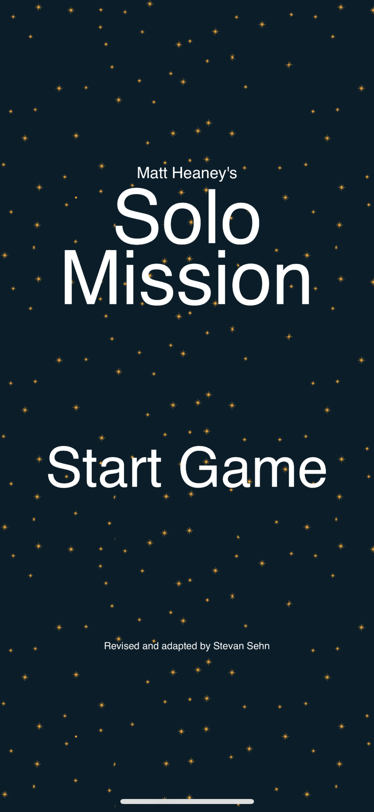
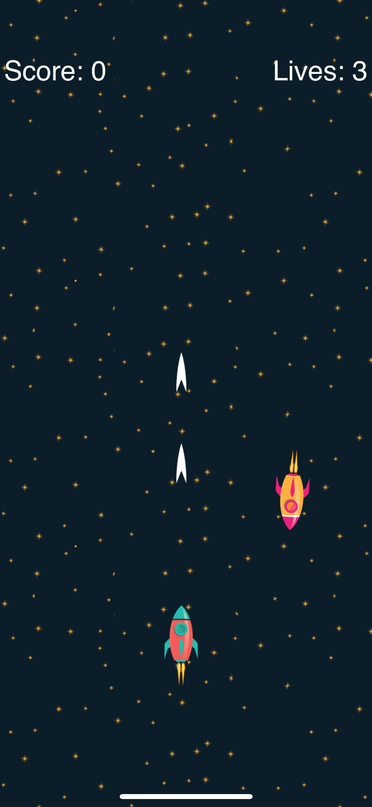
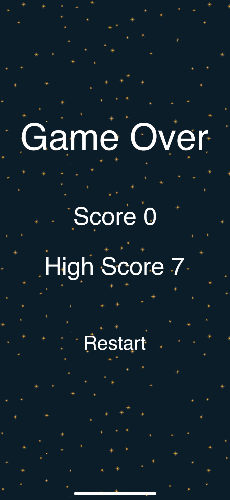

# swift-solo-mission
An updated version of Matt Heaney's Solo Mission iOS game with minor modifications:

 * When hit by an enemy ship, instead of running game over, the player loses a life and a new player ship is respawned; game over once lives reach zero;
 * Code adaptations due to Xcode and SpriteKit updates;
 * Different sound effects and backing music since previous ones have been removed.
 
### Matt Heaney's Solo Mission full course:
[Solo Mission (Space Invaders) - Make A Full iPhone Game In Xcode](https://www.youtube.com/watch?v=mvlwZs2ehLU&list=PLrL5aCF7Ods-6C7QjzXibUZoYjMzhWBfL)

### Assets: 

Assets: https://files.fm/u/qexnnmj3r

### Fonts:

Bold font: http://www.dafont.com/the-bold-font.font

### Sounds:

Bullet: https://freesound.org/people/bubaproducer/sounds/151011/

Explosion: https://freesound.org/people/cabled_mess/sounds/350978/

Backing music: https://freesound.org/people/XHALE303/sounds/473915/

## Screenshots

